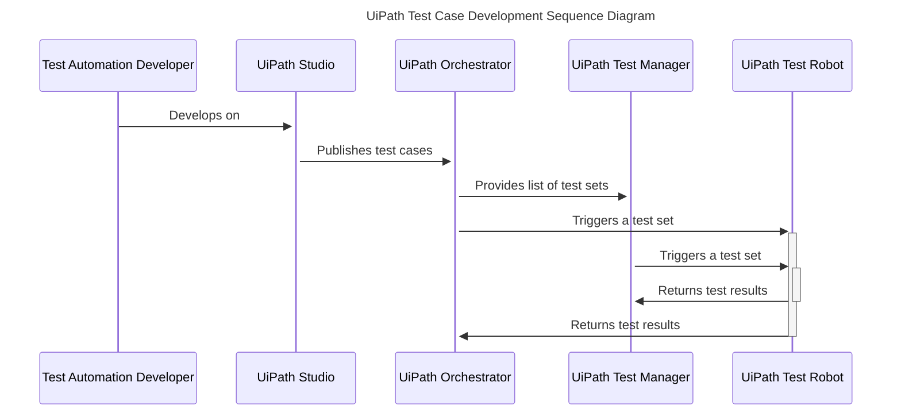
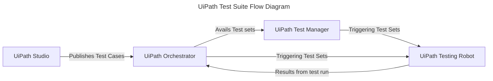

In the last couple of years UiPath's test suite has been maturing and expanding on its user base.  

```mermaid

---
title: UiPath Test Case Development Sequence Diagram
---

sequenceDiagram
Test Automation Developer->>+UiPath Studio:Develops on
UiPath Studio->>+UiPath Orchestrator: Publishes test cases
UiPath Orchestrator->>+UiPath Test Manager:Provides list of test sets
UiPath Orchestrator  ->>+ UiPath Test Robot:Triggers a test set
UiPath Test Manager  ->>+ UiPath Test Robot:Triggers a test set
UiPath Test Robot ->>- UiPath Test Manager :Returns test results
UiPath Test Robot ->>- UiPath Orchestrator :Returns test results
```

------------------------------------------

```mermaid

---
title: UiPath Test Suite Flow Diagram
---

flowchart LR
    A[UiPath Studio]-->|Publishes Test Cases|B[UiPath Orchestrator]
    B[UiPath Orchestrator] -->|Avails Test sets| C[UiPath Test Manager]
    C --> |Triggering Test Sets|D[UiPath Testing Robot]
    B-->|Triggering Test Sets| D
    D-->|Results from test run|B


```

