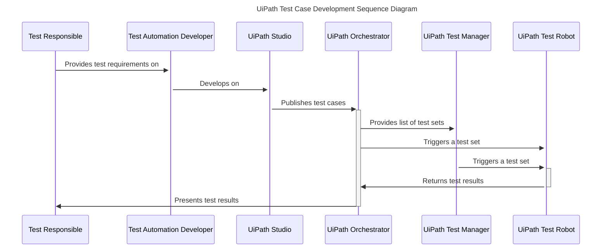
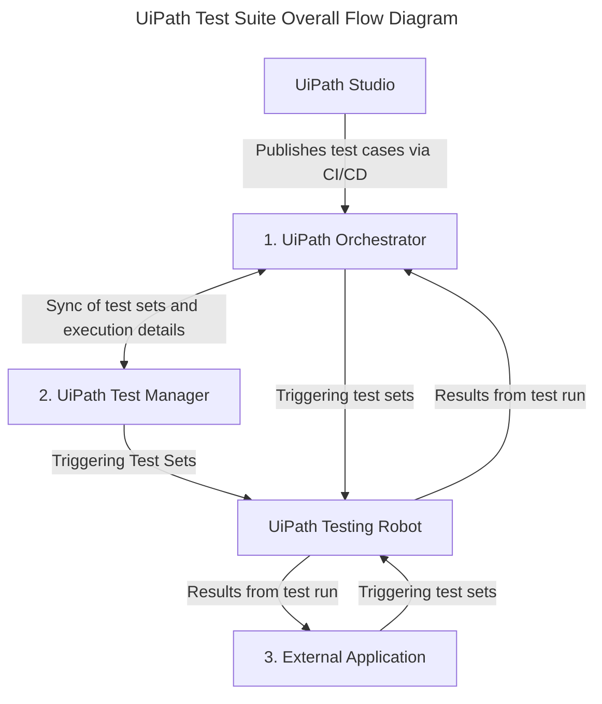
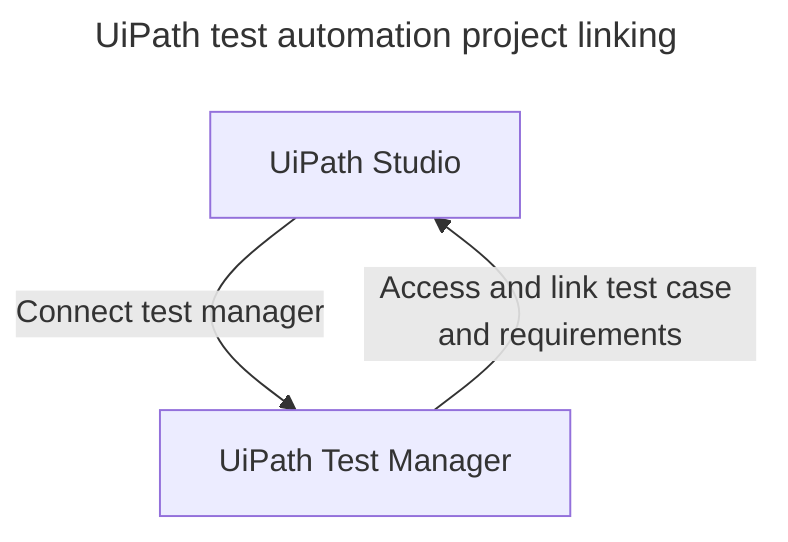
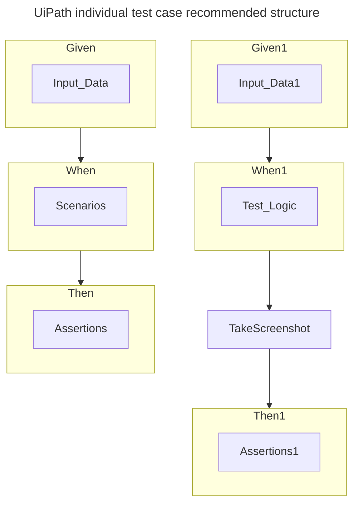

In the last couple of years UiPath's test suite has been maturing and expanding on its user base.  

This series of posts will explain the UiPath test suite offering in a visual manner. 

## UiPath test automation development sequence

------------------------------------------

## UiPath test suite overall flow diagram

## UiPath test automation project linking

## UiPath individual test case recommended structure

