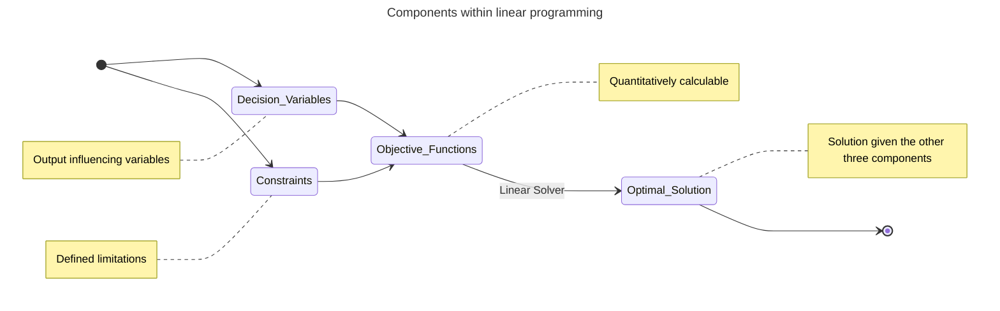

During a meeting at work, a presentation on an optimization problem was made by researches working in the local hospital. They were looking to minimizing staffing resources given certain variables and constraints. 

The field which studies such problems is called "Linear Programming". I remember studying this vaguely during my bachelors in industrial engineering, but since then I have forgotten the basics of it. 

In short, linear programming is used to find an optimal solution while adhering to the variables within the system and the constraints which define the limitations. 

---------------------------------------------

----------------------------------------------
#### Case
Consider a case of staffing a hospital. Nurses and doctors are expected to working in shifts, but as the rest of us they too may have personal commitments which have to be taken into consideration when planning for resource utilization. Some of them may be specialists in one form of care so they cannot not easily be replaced by others from the resource pool. 

Now such problems are where linear programming is most useful. 

In the above case we are trying to maximize resource utilization while considering the dynamic nature of resource availability and skills while also adhering to constraint of minimum required resources for smooth operations. 

Docplex, PluP, Pyomo and Gekko are some of the well known python modules to perform linear programming. 

#### References
   https://byjus.com/maths/linear-programming/#components

   

   
   
