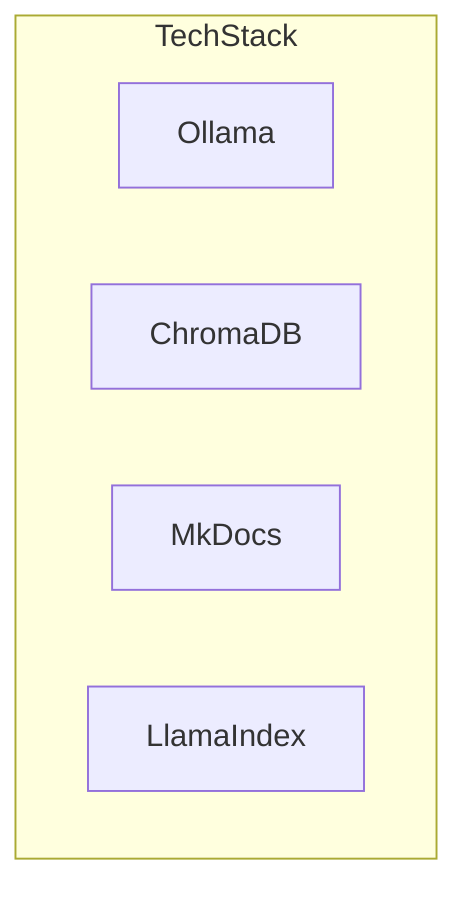
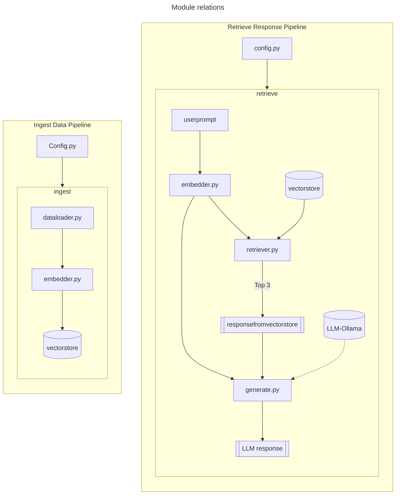

```mermaid

flowchart TD
    subgraph TechStack
        Ollama 
        ChromaDB
        MkDocs
        LlamaIndex
    end


```

Module relationships

```mermaid

---
title: Module relations
---

flowchart TD


subgraph Retrieve Response Pipeline
    direction TB
    subgraph retrieve
        direction TB
        sg2_retriever[retriever.py]
        sg2_embedder[embedder.py]
        sg2_prompt[userprompt]
        sg2_vectorstore[(vectorstore)]
        sg2_responsefromvectorstore[[responsefromvectorstore]]
        sg2_generate[generate.py]
        sg2_LLMResponse[[LLM response]]
        sg2_LLMModel[(LLM-Ollama)]
    end

    sg2_config[config.py] --> retrieve
    sg2_prompt --> sg2_embedder --> sg2_retriever -->|Top 3| sg2_responsefromvectorstore
    sg2_vectorstore --> sg2_retriever
    sg2_embedder --> sg2_generate
    sg2_responsefromvectorstore --> sg2_generate 
    sg2_generate --> sg2_LLMResponse
    sg2_LLMModel -.-> sg2_generate
end


subgraph Ingest Data Pipeline
    direction TB
    subgraph ingest
        direction TB
        dataloader.py
        embedder.py
        vectorstore[(vectorstore)]
    end

    Config.py --> ingest
    dataloader.py --> embedder.py --> vectorstore


end
 

```
