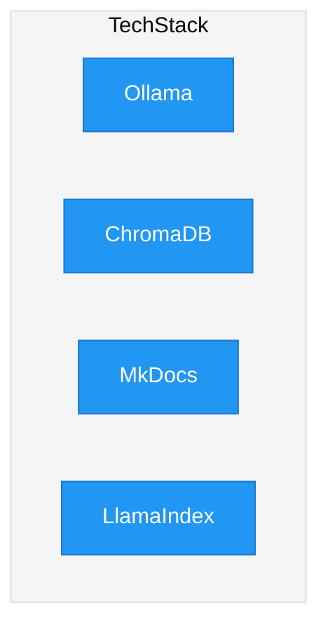

Module relationships
```mermaid

%%{
  init: {
    'theme': 'base',
    'themeVariables': {
      'primaryColor': '#2196F3',
      'primaryTextColor': '#FFFFFF',
      'primaryBorderColor': '#1976D2',
      'lineColor': '#FF5722',
      'secondaryColor': '#4CAF50',
      'tertiaryColor': '#F5F5F5'
    }
  }
}%%


---
title: Module relations
---

flowchart TB

subgraph Config
end


subgraph Retrieve response
    direction TB
    subgraph retrieve
        direction TB
        sg2_retriever[Retrieve-ChromaDB]
        sg2_embedder[Embedding-Ollama]
        sg2_prompt[userprompt]
        sg2_vectorstore[(vectorstore)]
        sg2_RetrievedDocuments[[RetrievedDocuments]]
        sg2_generate[Generate-Ollama]
        sg2_LLMResponse[[LLM response]]
        sg2_LLMModel[(LLM-Ollama)]
        sg2_SystemPrompt[SystemPrompt]
    end

    
    sg2_prompt --> sg2_embedder --> |Semantic search|sg2_retriever -->|Top n results| sg2_RetrievedDocuments
    sg2_vectorstore --> sg2_retriever
    sg2_embedder --> sg2_generate
    sg2_RetrievedDocuments --> sg2_generate 
    sg2_SystemPrompt --> sg2_generate
    sg2_generate --> sg2_LLMResponse
    sg2_LLMModel --> sg2_generate
end


subgraph Ingest data
    direction TB
    subgraph ingest
        direction TB
        Dataloading
        Embedding-Ollama
        vectorstore[(vectorstore)]
    end

    Dataloading --> Embedding-Ollama --> vectorstore


end

vectorstore -.-> sg2_vectorstore
Config --> ingest 
Config --> retrieve 
```
