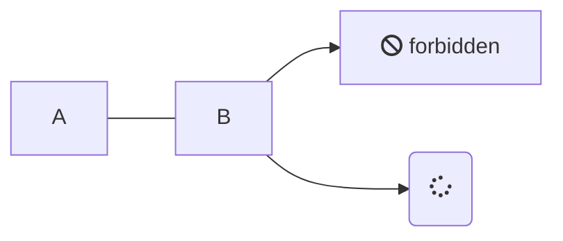
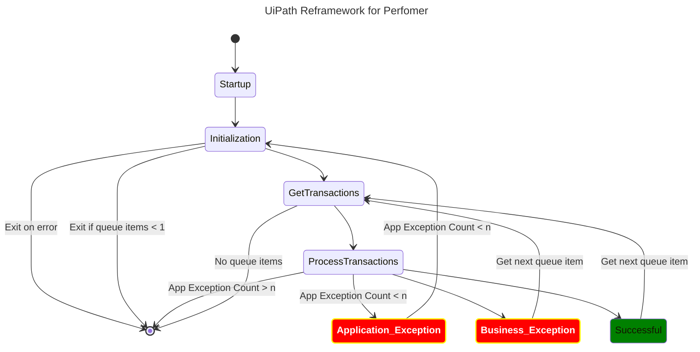

I have been searching for a tool which can create diagrams based on declarative texts (diagram as code). A tool much like graphviz but easier to get started with and use. Two tools which fits my requirements are:

1. Mermaid
	* https://github.com/mermaid-js/mermaid 
	* https://mermaid.js.org/intro/getting-started.html
2. Kroki
	*  https://github.com/yuzutech/kroki : 
	*  https://kroki.io/#cheat-sheet

## Mermaid 

Mermaid offers plenty of charts to choose from and has a user friendly syntax. The documentation provides many examples for different diagrams and the syntax seem to be easy to learn.

There are many ways to convert the diagram definitions as described below.


### Using Docker 

1. Using docker container can read a `.mmd` file and generate a output in the given path

```docker
docker run --rm -u `id -u`:`id -g` -v ~/Path/ToDiagramCode:/data minlag/mermaid-cli -i diagram.mmd
```

Output:

### Using a HTML file 
In the below example from mermaid's documentation, we define the diagram within a `<pre></pre>` tag and of `class=mermaid`. 
```html
<!DOCTYPE html>
<html lang="en">
  <body>
    <pre class="mermaid">
  graph LR
      A --- B
      B-->C[fa:fa-ban forbidden]
      B-->D(fa:fa-spinner);
    </pre>
    <script type="module">
      import mermaid from 'https://cdn.jsdelivr.net/npm/mermaid@10/dist/mermaid.esm.min.mjs';
    </script>
  </body>
</html>
```

This html can then be served and the DOM of the webpage is updated like so. 


### Using mermaid-live-editor
#### Online 
The maintainers of mermaid have also open-sourced the live editor [https://mermaid.live/](https://mermaid.live/) so that users can opt to run them locally. This self-hosting option is a handy option to have for users who do not want to use the hosted live-editor (although everything runs in the users browser even in the cloud version). 
#### Self-hosted
To spin up your own instance of the live-editor use the docker/podman command. 
```docker-cli
docker run --platform linux/amd64 --publish 8000:8080 ghcr.io/mermaid-js/mermaid-live-editor
```
To change the port which is mapped to the container port 8080 edit  `--publish 8081:8080`
This will then run mermaid server at https://localhost:8080

You have other options which can be customized, such as `MERMAID_RENDERER_URL` and  `MERMAID_KROKI_RENDERER_URL`. Details can be found at https://github.com/mermaid-js/mermaid-live-editor


### Using obsidian

An example diagram definition followed by the output (rendered within obsidian with `mermaid` tag). No extra community packages need to be installed within obsidian for this to work. 
```
---
title: UiPath Reframework for Perfomer
---
stateDiagram-v2

classDef badBadEvent fill:#f00,color:white,font-weight:bold,stroke-width:2px,stroke:yellow
classDef goodEvent fill:green

    [*] --> Startup
    Startup --> Initialization
    Initialization --> [*]: Exit on error
    Initialization --> [*]: Exit if queue items < 1
    Initialization --> GetTransactions
    GetTransactions --> ProcessTransactions
    ProcessTransactions -->  Application_Exception: App Exception Count < n
    ProcessTransactions -->  [*]: App Exception Count > n
    Application_Exception:::badBadEvent  -->  Initialization: App Exception Count < n
    ProcessTransactions -->  Business_Exception
    Business_Exception:::badBadEvent  -->  GetTransactions: Get next queue item
    ProcessTransactions -->  Successful
    Successful:::goodEvent -->  GetTransactions: Get next queue item
    GetTransactions --> [*]:No queue items
```



### Using VSCode extension
[Markdown Preview Mermaid Support](https://github.com/mjbvz/vscode-markdown-mermaid.git) from Matt Bierner can render any mermaid diagram definition and the UI interface allows the user to export the diagram in different image formats. 


### Using Mermaid CLI
If one prefers the command line, then [mermaid-cli](https://github.com/mermaid-js/mermaid-cli.git) is the official CLI by the maintainers of mermaid js. This option will require installation of additional javascript libraries, which some might want to avoid. 

Installing mermaid-cli 
```bash
npm install -g @mermaid-js/mermaid-cli
```
The below command takes in an input diagram definition and outputs the diagram file in the requured format.
```bash
mmdc -i input.mmd -o output.svg
```


## Kroki
Kroki allows the user to use any of the supported drawings tools and creates a REST API endpoints which the user can integrate in their applications. The overhead of interfacing with variety of "Diagram as code" tools is avoided by using Kroki. 

#### Using docker 
This is quite straight forward the user defines the port to be mapped. Kroki is 
```docker
docker run -d -p 8000:8000 yuzutech/kroki
```
What is great with kroki is provides a one-stop-shop to integrate with many tools via a REST-API. That said, the documentation of usage is somewhat lacking in my opinion.
The documentation provides ways to interact with the API for different tools: https://docs.kroki.io/kroki/setup/http-clients/ 


