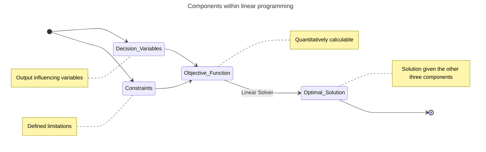

At work I attended a presentation on an optimization problem was made by researches working in the local hospital. They were looking to minimizing staffing resources given certain variables and constraints. 

The field which studies such problems is called Linear Programming (LP). I remember studying this vaguely during my bachelors in industrial engineering, but since then I have forgotten the basics of it. 

Consider a case of staffing a hospital. Nurses and doctors are expected to working in shifts, but as the rest of us they too may have personal commitments which have to be taken into consideration when planning for resource utilization. Some of them may be specialists in one form of care so they cannot not easily be replaced by others from the resource pool. 

Now such problems are where linear programming is most useful. 

In the above case we are trying to maximize resource utilization while considering the dynamic nature of resource availability and skills while also adhering to constraint of minimum required resources for smooth operations. 


---------------------------------------------



----------------------------------------------
> In summary, linear programming is used to find an optimal solution given the variables of the system and adhering to the constraints which define the limitations within the system. The end goal is to either maximize or minimize an objective function is either maximized or minimized. 
{: .prompt-tip}


## Modules in python
[PluP](https://pypi.org/project/PuLP/), [Docplex](https://pypi.org/project/docplex/),  [Pyomo](https://pypi.org/project/Pyomo/) and [Gekko](https://pypi.org/project/gekko/) are some of the well known python modules used to solve linear programming problems. 

LP solvers are independent of the python modules, as many LP solvers are openly available and the python modules have built an api over these solvers to make it easier to integrate in python. 


## Example problems
Solving some problems without help and only understanding from videos watched was a great way to test my understanding of the concept. Problem 1 and Problem 2 are credited to [Byjus](https://byjus.com/maths/linear-programming/#components).

### Problem 1 - Vitamin blending
*A doctor wishes to mix two types of Dishes in such a way that the vitamin contents of the mixture contain at least 8 units of vitamin A and 10 units of vitamin C. Dish 1 contains 2 units/kg of vitamin A and 1 unit/kg of vitamin C. Dish 2 contains 1 unit/kg of vitamin A and 2 units/kg of vitamin C. It costs Kr 50 per kg to purchase Dish 1 and Kr 70 per kg to purchase Dish 2. Formulate this problem as a linear programming problem to minimize the cost of such a mixture*

#### Intuition
> Formulating the  problem. Before we do that we create a table to make this easier. 
This [video](https://www.youtube.com/watch?v=_ewPTxICHHA&list=PLbxFfU5GKZz1Tm_9RR5M_uvdOXpJJ8LC3&index=31) was of good to understand and build an intuition. 
{: .prompt-tip}

|           | Vitamin A (units) | Vitamin C (units) | Cost (Kr)|
|-----------|-------------|--------|---------|
|Dish 1    |   2     |     1     |   50|
|Dish 2   |    1    |     2      |  70|
|Daily need  | 8    |     10|

For simplicity `Vitamin A = x Vitamin C = y`

**Variables** `x, y daily feed in units`

**Objective function**: `f(x, y) = 50*x + 70*y` --> Minimzation problem

**Subject to constraints**:
```
2*x + 1*y >= 8
1*x + 2*y >= 10
x >=0
y >= 0
``` 
#### Python implementation
```python
import pulp   

# Creating LP problem
"""
Here we are looking to minimize the cost while getting the enough of vitamin a and c in the diet. This is therefore a minimization LP problem.
"""
vitamin_mix_lp = pulp.LpProblem("vitamin_mix_lp", pulp.LpMinimize)

# Creating LPvariables
x = pulp.LpVariable("Dish 1", lowBound=0, cat='Integer')
y = pulp.LpVariable("Dish 2", lowBound=0, cat='Integer')

# Creating Constraints: Mixture contain at least 8 units of vitamin A and 10 units of vitamin C
vitamin_mix_lp += 2*x + 1*y >=8
vitamin_mix_lp += 1*x + 2*y >= 10
vitamin_mix_lp += x >= 0
vitamin_mix_lp += y >=0

# Creating the objective function: f(x, y) = 50*x + 70*y
vitamin_mix_lp += 50*x + 70*y

# Solving the objective function
solution = vitamin_mix_lp.solve()

# Printing the results and optimal variable values
print("Status:", solution) # 1: Optimal solution exists
print("Optimal Solution Value:", vitamin_mix_lp.objective.value(), "Kr.")
for var in vitamin_mix_lp.variables():
    print(var.name, "=", var.varValue, "units")
```

**Output** from the above problem results in 2 units of dish 1 and 4 units of dish 2, which results in the minimum cost of 380 kroner while adhering to the set constraints. 

```bash
Status: 1 (optimal solution exists)
Optimal Solution Value: 380.0 Kr.
Dish_1 = 2.0 units
Dish_2 = 4.0 units
```

-------------------------

### Problem 2 - Bakery case

*One kind of cake requires 200g of flour and 25g of fat, and another kind of cake requires 100g of flour and 50g of fat.  Formulate this problem as a linear programming problem to find the maximum number of cakes that can be made from 5kg of flour and 1 kg of fat assuming that there is no shortage of the other ingredients used in making the cakes.*

#### Intuition
> Formulating the problem. We here are trying maximize the amount of cakes baked given the limited supplies. 
{: .prompt-tip}

|           | Flour (grams) | Fat (grams) | 
|-----------|-------------|--------|
|Cake A    |   200     |     25     |  
|Cake B   |    100    |     50      |  
|Availability  | 5000    |     1000|

For simplicity `Flour = x & Fat = y`

**Variables** `x, y in grams`

**Objective function**: `f(x, y) = SUM((200*x + 100*y),(25*x + 50*y))` --> Maximization problem

**Subject to constraints**:
```
200*x + 100*y <= 5000
25*x + 50*y <= 1000
x >=0
y >= 0
```

#### Python implementation
```python
import pulp   

# Creating LP problem: Here we are looking to maximize the objective function.
bakery_lp = pulp.LpProblem("bakery_lp", pulp.LpMaximize)

# Creating LPvariables
x = pulp.LpVariable("Cake A", lowBound=0, cat='Integer')
y = pulp.LpVariable("Cake B", lowBound=0, cat='Integer')

# Creating Constraints:number of cakes that can be made from 5kg of flour and 1 kg of fat
bakery_lp += 200*x + 100*y <= 5000
bakery_lp += 25*x + 50*y <= 1000
bakery_lp += x >= 0
bakery_lp += y >=0

# Creating the objective function: f(x, y) = (200*x + 100*y)+(25*x + 50*y)
bakery_lp += (200*x + 100*y)+(25*x + 50*y)

# Solving the objective function
solution = bakery_lp.solve()

# Printing the results and optimal variable values
print("Status:", solution) # 1: Optimal solution exists
print("Optimal Solution Value:", bakery_lp.objective.value())
for var in bakery_lp.variables():
    print(var.name, "=", var.varValue, "units")
```
**Output** from the above problem results in 20 units of cake 1 and 10 units of cake 2, which results in the maximum revenue of 6000 kroner while adhering to the set constraints. Totally 30 cakes need to be baked by the baker.

```bash
Status: 1
Optimal Solution Value: 6000 kr.
Cake_A = 20.0 units
Cake_B = 10.0 units
```

-------------------------

### Problem 3 - Protein intake 
This problem is sourced from [Brilliant.org](https://brilliant.org/wiki/linear-programming/)

*An amateur bodybuilder is looking for supplement protein bars to build his muscle fast, and there are 2 available products: protein bar A and protein bar B.
Each protein bar A contains 15 g of protein and 30 g of carbohydrates and has total 200 calories. On the other hand, each protein bar B contains 30 g of protein and 20 g of carbohydrates and has total 240 calories.
According to his nutritional plan, this bodybuilder needs at least 20,000 calories from these supplements over the month, which must comprise of at least 1,800 g of protein and at least 2,200 g of carbohydrates.
If each protein bar A costs $3 and each protein bar B costs $4, what is the least possible amount of money (in $) he can spend to meet all his one-month requirements?*


#### Intuition
> Formulating the problem. We here are trying maximize the amount of cakes baked given the limited supplies. 
{: .prompt-tip}

|           | Protein (grams) | Carbohydrates (grams) | Calories     | Cost ($)|
|-----------|-------------|--------|--------|--------|
|Protein A    |   15     |     30     |  200 |    3 |   
|Protein B   |    30    |     20      | 240 |     4 |
|Need  | 1800    |     2200 | 20000|    |

For simplicity `Protein A = x & Protein B = y`

**Variables** `x, y` 

**Objective function**: `f(x, y) = (3*x + 4*y)` --> Minimization problem

**Subject to constraints**:
```
15*x + 30*y >= 1800
30*x + 20*y >= 2200
200*x + 240*y >= 20000
x >= 0
y >= 0
```

#### Python implementation
```python
import pulp   

# Creating LP problem: Here we are looking to minimize the objective function.
bodybuilderdiet_lp = pulp.LpProblem("bodybuilderdiet_lp", pulp.LpMinimize)

# Creating LPvariables
x = pulp.LpVariable("Protein", lowBound=0, cat='Integer')
y = pulp.LpVariable("Carbohydrates", lowBound=0, cat='Integer')

# Creating Constraints
bodybuilderdiet_lp += 15*x + 30*y >= 1800
bodybuilderdiet_lp += 30*x + 20*y >= 2200
bodybuilderdiet_lp += 200*x + 240*y >= 20000
bodybuilderdiet_lp += x >= 0
bodybuilderdiet_lp += y >=0

# Creating the objective function: f(x, y) = (3*x + 4*y)
bodybuilderdiet_lp += 3*x + 4*y

# Solving the objective function
solution = bodybuilderdiet_lp.solve()

# Printing the results and optimal variable values
print("Status:", solution) # 1: Optimal solution exists
print("Optimal Solution Value:", bodybuilderdiet_lp.objective.value())
for var in bodybuilderdiet_lp.variables():
    print(var.name, "=", var.varValue, "units")

```

**Output** from the above problem results in 25 units of Carbohydrates and 70 units of Protein, which results in the minimum expense of 310 dollars while adhering to the set constraints. 


```plaintext
Status: 1
Optimal Solution Value: 310.0 $
Carbohydrates = 25.0 units
Protein = 70.0 units
```

## Resources 
Here are some of the resources which helped me learn the concepts of linear programming with no specific order.

I enjoyed reading this to dig deeper into the workings of LP: https://www.uky.edu/~dsianita/300/online/LP.pdf

   

   Video tutorials on linear programming 
   

   A deep dive into concepts behind linear programming 
   

   

   Using PulP in python
   
