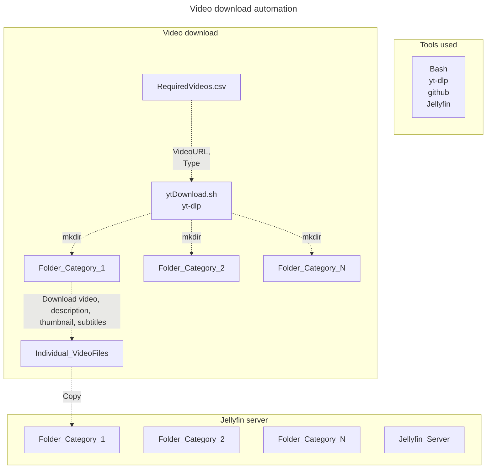

Being a dad comes with opportunities to automate mundane chores. To curate a sensible kids video collection, I have to download select videos from YouTube. To organize this content, I have recently setup a container running the [jellyfin](https://jellyfin.org) media (offline) server. This exercise of curation and downloading videos manually requires a lot of unnecessary effort and should be have been automated. 

 
*Yes, it is time to automate!*


### Solution architecture
Below is the solution architecture. The input or the video urls are saved on a csv with headers `VideoURL` & `Type`. 




This `.csv` file then is an input file to a `bash` script. The `bash` script iterates over the rows in the csv file and uses the [yt-dlp](https://github.com/yt-dlp/yt-dlp.git) project/cli tool to download videos. In short, it will help me build a video collection (for personal use) with minimal resistance. 

The next time when I or my wife want to add a video, we add a row in the `.csv` file with the video url and a corresponding type (category). 


### ytDownload.sh script 

```bash
#!/bin/bash

# Reading the csv file and using Videos column
VIDEO_URLS= readarray -t eCollection < <(cut -d, -f1,2 RequiredVideos.csv)

# Set the directory where you want to save the downloaded files
OUTPUT_DIR="."

# Create the output directory if it doesn't exist
mkdir -p "$OUTPUT_DIR"

for row in ${eCollection[@]:1} 
do
url=$(echo "$row" | cut -d, -f1)
typeVideo=$(echo "$row" | cut -d, -f2)
echo "Starting to download : "$url" "
# Download the video and its subtitles no special characters do not overwrite video if already found(if available)
yt-dlp -f 'bestvideo[ext=mp4]+bestaudio[ext=m4a]' --write-auto-sub --write-description --sub-lang en --restrict-filename --no-force-overwrites --output "$typeVideo/%(title)s/%(title)s" "$url"
echo "Completed download : "$url" "
done
```


#### Command explanation
* Get the best video resolution, 
* Best audio quality, 
* Download subtitles if available in english, 
* Download description if available, 
* Remove symbols and special characters from video filename, 
* Skip download if resource already found in target folder, 
* Save to respective `type/videofilename` folder 

```bash
yt-dlp -f 'bestvideo[ext=mp4]+bestaudio[ext=m4a]' --write-auto-sub --write-description \
 --sub-lang en --restrict-filename --no-force-overwrites --output "$typeVideo/%(title)s/%(title)s" "$url"
```

### Further improvements 
The input `.csv` should be made accessible via a network-attached-storage device which supports a native mobile app. This way we always have access to the input file.

A further step would be to run a cron job on a server to look for new rows added in the `.csv` file and run the script. This will ensure that my `jellyfin` collection is always up-to-date. 


### Credits

Thank you to all the maintainers of [yt-dlp](https://github.com/yt-dlp/yt-dlp.git)!