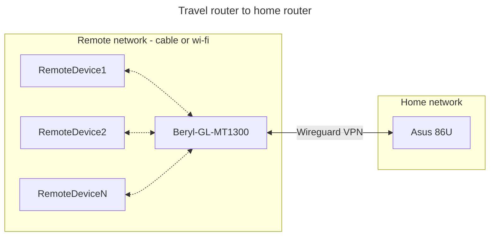

After weeks of researching for the ideal travel router in March of this year, I decided to buy the [Beryl GL MT1300 travel](https://www.gl-inet.com/products/gl-mt1300/) router from [Gl-inet](https://www.gl-inet.com/). 

### Requirements for a travel router 
My requirements were quite basic:
* Wi-fi 6 or higher
* Function as a repeater/range extender so that I could also use it also at home when not traveling
* Function as a VPN client (Wireguard preferably)
* A functional UI for administration
* Open source firmware which can ensure long-term updates for the device
* Toggle switch to activate the VPN client
* Can be connected to internet via a RJ45 cable or via Wi-fi 
* A positive if it also came with compatible power plugs
* Positive reviews and security reviews 

### Travel router networking 

The plan was to use my existing VPN on my ASUS router and connect to the it via the travel router's VPN client functions. 

>This meant that all devices connected to the travel router in the remote location can browse the internet via the VPN (wiregaurd). I could also avoid creating separate Wiregaurd configurations for all devices/users who need access. Additionally, since the VPN client runs on the travel router, the mobile device would avoid draining the battery as it usually would when a VPN is connected. 
Fantastic!
{: .prompt-tip}

 

The only preparation required from my end was to connect all the devices to the travel routers wi-fi SSID while connected to the home network (before the trip). 

### The first experience  
Under a work trip in May, I could finally use this router. Everything went as planned, the remote wifi (hotel wi-fi) was connected to the travel router. Via the toggle switch the Wireguard client was started and all my devices connected to the travel router at the remote location without any hiccups.

Overall, I am quite satisfied with the performance of this tiny travel router and this certainly will be a part of my future travels. I would happily recommend this to my contacts. 