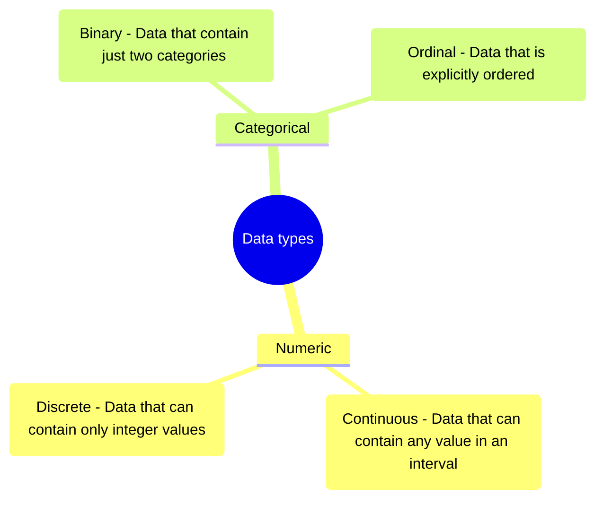
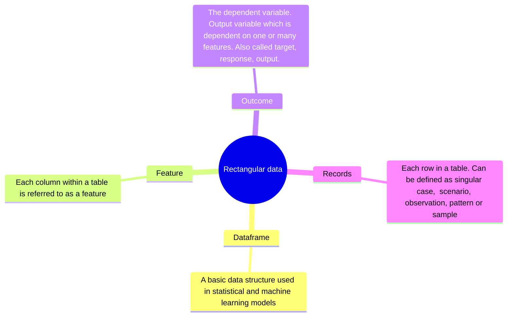

This is my personal notes of the book [Practical Statistics for Data Scientists - 50+ Essential Concepts Using R and Python by Peter Bruce, Andrew Bruce, Peter Gedeck.](https://books.google.no/books?hl=no&lr=&id=k2XcDwAAQBAJ&oi=fnd&pg=PP1&dq=9781492072942&ots=dEKcnlVmx1&sig=A4W7tK5Um6BTbuzr3_gOvVinDRg&redir_esc=y#v=onepage&q=9781492072942&f=false) I will update this post, as I study and digest the contents of this book.


## Chapter 1 - Exploratory Data Analysis 

John W. Tukey established the field of exploratory data analysis through his 1977 publication [exploratory data analysis](https://archive.org/details/exploratorydataa0000tuke_7616), in which he introduced methods to explore a dataset by using plots and summary statistics (mean, median etc.). Later in 2015, one of Tukey's former undergraduate student David Donoho published a summary article [50 years of Data Science](https://courses.csail.mit.edu/18.337/2015/docs/50YearsDataScience.pdf) showing the genesis and developments of data science as a field.


* Before analyzing the data it is important to identify the type of data to be studied. 
* Type of data can influence the kind of data analysis methods which can be used to explore the data. 

The figure below provides the taxonomy of data types. 


#### Ordinal data 
The interesting data type above is the ordinal data type where the order of the data is important. Here is an example of ordinal data type using sklearn. 

```python
from sklearn.preprocessing import OrdinalEncoder
enc = OrdinalEncoder()
X = [['Male', 1], ['Female', 3], ['Female', 2]]
enc.fit(X)
enc.categories_
```
`[array(['Female', 'Male'], dtype=object), array([1, 2, 3], dtype=object)]`

```python
enc.transform([['Female', 3], ['Male', 1]])
```
`array([[0., 2.],[1., 0.]])`


Explanation of `enc.transform`
First sample: `['Female', 3]`

    Gender column: 'Female' is the first category in enc.categories_ → encoded as 0
    Number column: 3 is the third category in enc.categories_[1] → encoded as 2
    Result: [0., 2.]

Second sample: `['Male', 1]`

    Gender column: 'Male' is the second category → encoded as 1
    Number column: 1 is the first category → encoded as 0
    Result: [1., 0.]


```python
enc.inverse_transform([[1, 1], [0, 2]])
```
`array([['Male', 2],['Female', 3]], dtype=object)`


### Rectangular data
Typically analysis in data science focuses on rectangular data. It is a two-dimensional matrix containing records in form of rows and features/variables in form of columns. Rectangular data is usually the result of some preprocessing of unstructured data. Following are the key terms in rectangular data. 





### Non rectangular data structures

* **Time Series data** records sequential measurement of a same variable with time. This kind of data is used to create statistical forecasting models. An example is a IOR sensor capturing temperature data every 2 minutes perpetually. Such data structure always need to include a time at which the record was captured. 
  
* **Spatial data** can be used to create location based analytics. The object understand observation can be for example a house or a point of interest in a map and its spatial coordinates. 
  
* **Graph/ Network** are used to represent abstract relationships between the object under observation. An example can be a social network of a person showing how many contacts or friends that person has and how often he/she interact with them. These types of data are useful in recommender systems and optimization problems. 

All these three can also be combined in some use case. For example, Google maps can store spatial data in a time series manner for a person and include a graph/ network data on how the user interacts when they travel 60 kms away from their home. 


> **Difference in terminologies**
> 
> Statisticians use **predicator variables** to predict a response or **dependent variable** and data scientist use **features** to predit a **target** 
>
> The term **sample** to a computer scientist signifies a single row while a **sample** to a statistician means a collection of rows.
>
> Graph in statistics can mean plots or visualization and not just connections of entities as it is in computer science or information technology.
{: .prompt-info }


## Related literature 
* Jon Tukey : [Exploratory Data Analysis](https://archive.org/details/exploratorydataa0000tuke_7616)  

* David Donoho : [50 years of Data Science](https://courses.csail.mit.edu/18.337/2015/docs/50YearsDataScience.pdf) 

* Bruce, P., Bruce, A., & Gedeck, P. (2020). [Practical statistics for data scientists: 50+ essential concepts using R and Python](https://books.google.no/books?hl=no&lr=&id=k2XcDwAAQBAJ&oi=fnd&pg=PP1&dq=9781492072942&ots=dEKcnlVmx1&sig=A4W7tK5Um6BTbuzr3_gOvVinDRg&redir_esc=y#v=onepage&q=9781492072942&f=false). O'Reilly Media.