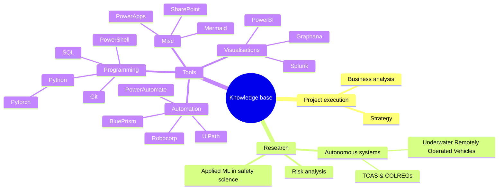

---
# the default layout is 'page'
icon: fas fa-info-circle
order: 4
mermaid: true
---
This website is an effort to document the journey of learning new technologies. 

After many years of working as a developer, I missed having a site where many of my learnings along the way could be easily accessed. A public knowledge base of learnings and just maybe I helps someone else along the way. 

Thats when I came across [jekyll](https://jekyllrb.com/) and found it the perfect match as it takes away the barrier of setting things up and lets one focus on writing and not worrying about the overheads involved in creating such a static webpage. I later found [jekyll-theme-chirpy](https://github.com/cotes2020/jekyll-theme-chirpy#quick-start) and based this website on it. 

Thank you to all the contributors of jekyll and jekyll-theme-chirpy!

Along this journey, following mindmap shall be updated.

