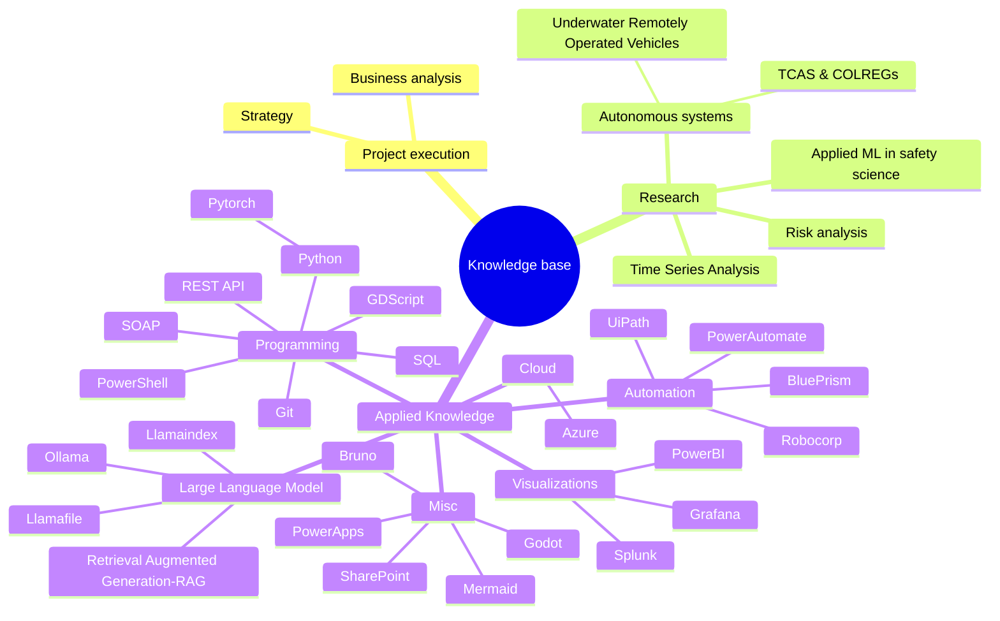

---
# the default layout is 'page'
icon: fas fa-info-circle
order: 4
mermaid: true
---
This website is an effort to document the journey of learning new technologies. 

After many years of working as a developer, I missed having a repository where many of my learnings along the way could be easily accessed. I also hope that by sharing my know-how I can help others along the way. 

After trying a bunch of static-site generators, I came across [jekyll](https://jekyllrb.com/) and found it to be the perfect match. Jekyll takes away the barrier of setting things up and lets me focus on writing and not worrying about the overheads involved in creating static webpages. Text files to websites great! I later found [jekyll-theme-chirpy](https://github.com/cotes2020/jekyll-theme-chirpy#quick-start) and based this website on it. 

Thank you to all the contributors of jekyll and jekyll-theme-chirpy!

------------------------

The plan is to write about my learnings on the topics covered in this mindmap, which will expand with new learnings.

------------------------
## Use of LLMs
If the content in the published posts are produced by using a online/local large-language-model, a clear attribution text with the following information will be shared in the post.

> This part was generated using Large Language Model (LLMMODEL) with the following prompt text: PROMTTEXT. 
{: .prompt-info}

------------------------

## Credits
Logo was generated using [Dummy-logo-maker](https://github.com/moiseshp/dummy-logo-maker). Thanks to [moiseshp](https://github.com/moiseshp)

-----------------------------------

All opinions written in this blog are my own.