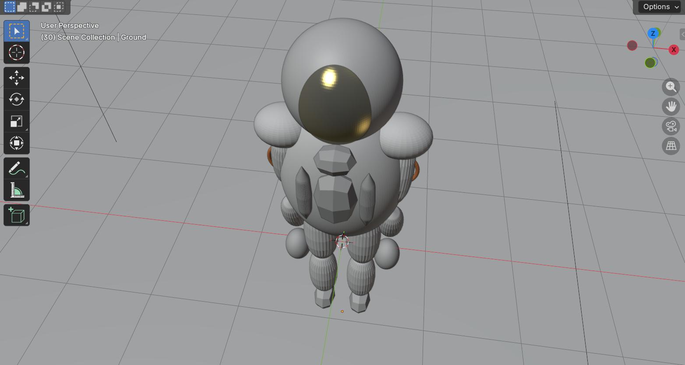

This week I found another rabbit hole: creating 3-D models via the blender-mcp server. It allows us to connect any LLM client and create 3-D objects via prompts. I was curious how local large language models would perform this task.

## Steps I followed

* Downloaded blender from the official website and installed it
* Opened blenders preferences and checked if there was an add-on called MCP they shouldn’t be one Google search for blender-MCP and you will find an MCP installation walk-through in blenders lab website.
* Download the add-on which allows to communicate with blender
* Cloned the llama.cpp repository from GitHub and built it locally
* Downloaded Qwen 3.6  35B model converted by Unsloth to GGUF format 
* Downloaded the official MCP server from GitHub and ran it using a UV
* Ran the llama.cpp server and connected the blender MCP from the UI blender MCP was running at local host port 9191
* Ensured that the add-on in blender was also active. By default it runs at port 9876

Then I started to prompt to this[ Qwen 3.6 model](https://huggingface.co/unsloth/Qwen3.6-35B-A3B-GGUF/blob/main/Qwen3.6-35B-A3B-UD-Q4_K_S.gguf) and I was surprised how good it was in agentic workflow. In one of the sessions I asked to create a snowman, in the next I asked to create an astronaut by giving it a random image URL of an astronaut. In about 40 minutes it had created a very basic 3-D model. 

### Results
Here is a screenshot of what it created. We live in amazing times where all of this could be run locally without ever having to worry about any weekly token limits. 

### My thoughts
This agentic generation took over 40 minutes to create a basic 3-D model! That is not effective enough plainly in terms of an agentic automation task. However, with a better dedicated GPU, this time could definitely be minimized to under 15 or 10 minutes. But that test is for some other time.

I also believe that in about 6 to 8 months time, when we have an open-source model which is as good as Anthropic's Sonnet 4.6 og OpenAI's GPT 5.4, we will see significant performance leaps for this specific application. 

Will I be using it often? **No** but it was great fun to play around with this new tech where we could just prompt our way to create 3-D objects. 

## References

* [The official Blender MCP addon](https://www.blender.org/lab/mcp-server/)
* [The official installation guide](https://projects.blender.org/lab/blender_mcp/wiki/Llama.cpp#mcp-server-installation)